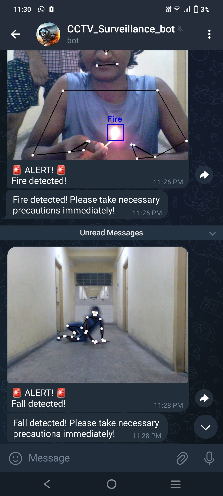

Real Time Video Surveillance And Triggering System
==============================

There is a critical need for an automated surveillance solution that can continuously and accurately monitor environments for signs of emergencies, providing real-time alerts to facilitate rapid intervention. Traditional systems relying on human operators are often slow and prone to errors, which can result in severe consequences, including loss of life and extensive propertydamage. Our project aims to develop a real-time emergency surveillance system that leverages computer vision to detect and respond to critical situations such as fires, violence, and medical emergencies.





# Project Demonstration Link:

[GDrive Link to Demo: ](https://drive.google.com/file/d/1YtPSY-Q1Xp_LdIYvHNcUdkq8IL7Nck73/view?usp=drive_link)

# Dataset link

https://www.kaggle.com/datasets/mohamedmustafa/real-life-violence-situations-dataset


# STEPS to run the project:

## STEP 01: 
Clone the repository

```bash
git clone https://github.com/Hirak010/Real-time-surveillance-detection.git
```

## STEP 02: 
Create an environment & activate


```bash
conda create -n env python=3.11 -y
```

## STEP 03: 
Install the requirements


```bash
pip install -r requirements.txt
```


## STEP 04: 
To run the webcam app


```bash
python alert.py
```

# Technical Aspects

## Human Fall Detection
### Methodology


- You can check distance between foot C.G and body C.G
- It's body center of gravity
- It's foot center of gravity
- You can check the count of how many times he fell.
- If distance over 90 pixel(tall * 0.75), It displays he falling.
- 1. Body C.G and foot C.G. 2. Only use X axis. 3. I use this distance difference to basis of judgment
- It indicates if he woke up. (This only displays after falling.)
- A count of 1 goes up in the area where you fell (the count is determined by which area your feet are in).

## Violence Detection
### Methodology


- A dataset having 1000 videos each of violence category and non
violence category was chosen
- A model was trained using MobileNetV2 using the dataset
- Real time video footage is given as input
- Output is obtained as image frames
- Use MobileNet V2 archvhitecture
- It is a Convolutional neural network that is 53 layers deep
- Provides real time classification capabilities under computing constraints in devices like smartphones.
- Utilizes an inverted residual structure where the input and output of the residual blocks are thin bottleneck layers.
- Uses lightweight convolutions to filter features in the expansion layer.


# Authors:
```bash
Authors: Hirakjyoti Medhi, Biswajit Bera, Ashutosh Kumar and Roshan Jha
Email: hirak170802@gmail.com
```
